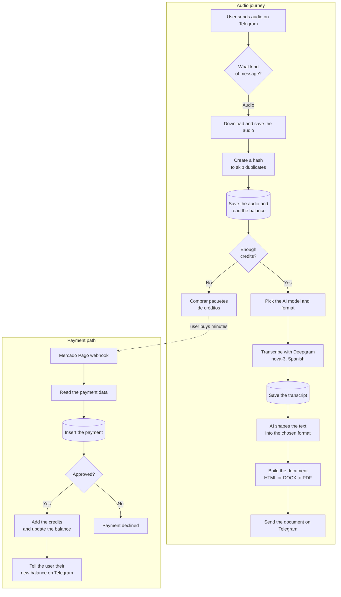

# Brudi Notas bot: how it works inside

## Quick intro

This is a plain-language look at how the **Brudi Notas bot** flow works inside the **Audio to Report Automation** project.

The idea is simple: the user talks to the bot on Telegram, sends an audio or a voice note, the bot checks their credits, turns that audio into text, shapes it with AI, and sends back a ready-to-read document.

The flow has two entry doors. One is **Telegram mensajes**, which takes in text, menu commands, and audios or voice notes. The other is **Confirmación pago**, a webhook that Mercado Pago pings whenever a payment goes through.

## In a nutshell

Think of the bot as a small automatic office.

It receives the audio, checks whether that same audio was already processed before, and confirms the user has enough credits. If everything is in order, it sends the audio to be transcribed. Then an AI arranges the content into the chosen format, a document is built, and the bot sends it back through Telegram.

If the user runs out of credits, the bot takes them to the **Comprar paquetes de créditos** sub-flow so they can buy more minutes with Mercado Pago.

## The flow at a glance

## The journey of an audio, step by step

1. The bot receives something from Telegram: text, a menu command, an audio, or a voice note.

2. The **Tipo entrada** node decides what kind of message arrived.

3. When it is audio, the flow pulls out the data it needs, downloads the file from Telegram, and saves it on disk for a moment.

4. It then creates a hash of the audio, a small fingerprint that keeps the same file from being processed twice.

5. Next it stores the audio record in the PostgreSQL database and reads the user's credit balance.

6. The bot checks whether the user has enough credits.

7. If they don't, it sends them over to the **Comprar paquetes de créditos** sub-flow.

8. If they do, the flow picks the right AI model and format for the job.

9. While it works, the bot keeps the user posted with short messages along the way: Audio en proceso, Transcribiendo audio, Analizando transcript, Dando formato, Convirtiendo PDF, and finally Flujo realizado.

10. To turn the audio into text it uses Deepgram with the nova-3 model in Spanish, telling speakers apart and adding punctuation and smart formatting.

11. The transcript is saved in the database.

12. The transcript then goes to an AI model that structures it into the format the user chose.

13. The result is turned into a document, either from HTML to PDF or from DOCX to PDF.

14. Finally, the bot sends it back through Telegram with the **Enviar documento** step.

## When the user pays for credits

Payment has its own path.

1. Mercado Pago notifies the flow through the **Confirmación pago** webhook.

2. A node reads the payment data. It figures out who the user is from their Telegram chat_id and which package they bought from a reference like chatid_paquete_1.

3. The flow inserts the payment into the database.

4. It checks whether the payment was approved or declined.

5. When it's approved, it records the purchase, adds the credits or minutes, updates the balance, and tells the user their new balance on Telegram.

## The formats the user can choose

The bot can deliver the result in different formats. Some belong to the basic plan and others to the premium plan:

| Format | Plan |
| --- | --- |
| Raw transcript | basic |
| Clean transcript | basic |
| Quick summary | basic |
| Detailed summary | premium |
| Conference notes | basic |
| Conference analysis | premium |
| Essential notes | basic |
| Complete notes | premium |
| Standard minutes | basic |
| Complete minutes | premium |
| Interview / podcast premium | premium |

There are also custom formats. The user uploads a template or reference document, the bot analyzes it, and saves it to reuse later. From the menus, the user can add and remove their own formats.

## The credit packages

Credits are bought as processing minutes, paid through Mercado Pago:

| Package | Minutes | Price |
| --- | ---: | ---: |
| Package 1 | 60 min | 29 MXN |
| Package 2 | 120 min | 59 MXN |
| Package 3 | 180 min | 79 MXN |
| Package 4 | 300 min | 119 MXN |

## What technology it uses under the hood (and why)

- **n8n** orchestrates the whole thing, like the conductor of the flow.
- **Telegram Bot API** is the channel where the user talks to the bot.
- **Deepgram** turns the audio into text.
- **AI models** arrange and structure the text into the chosen format.
- **PostgreSQL** is the database where everything is stored.
- **Mercado Pago** processes the payments.
- **Langfuse** handles observability, so it's easy to see how the AI behaves, its timing, and its tokens.
- **Dynamic menus** are the buttons inside Telegram to move around the main menu, profile, credits, formats, and support.

Depending on the format, the flow reaches for different AI models:

- **GPT-5.4-nano** for simple formats like the raw transcript.
- **GPT-5.4** and **GPT-4** for basic and premium OpenAI formats.
- **DeepSeek v4**, in its flash and pro versions, for several formats.
- **Google Gemini 3.1 Pro** to analyze reference documents for custom formats.

## What data the bot stores

The bot keeps its information organized by purpose, in tables inside the database:

- Users and their credit balance.
- Received audios, along with their hash to avoid duplicates.
- Transcripts.
- Payments and purchase movements.
- Credit usage per processing.
- Each user's custom formats.
- Used tokens and execution times for monitoring.

---

This is conceptual documentation to understand the flow in a clear, general way. Credentials, tokens, and sensitive internal details are handled separately.
